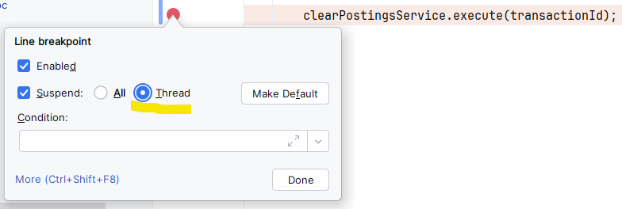
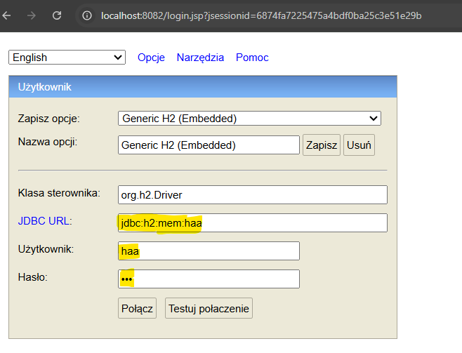

== Research on replacing `@ElementCollection` with `@OneToMany`

=== Motivation

I have two reasons for `@ElementCollection` with `@OneToMany`:

* `@ElementCollection` has performance issues with limited possibility to optimize, as described
  by Vlad Mihalcea:  https://vladmihalcea.com/how-to-optimize-unidirectional-collections-with-jpa-and-hibernate/

* `@ElementCollection` feels obscure and over-abstracted. It's not intuitively clear how this should behave
  when using Envers

So, even though this example doesn't involve use of Envers, it's still targeted toward effective use of Envers.

=== Challenges

* `@OneToMany` not only can be placed on List but also on Set. So we need to be able to ensure
  proper persistence when manipulating Set.

* we may need to deal with `@Entity` that doesn't have business key which could be used for
  `equals()`/`hashCode()` and has to rely on surrogate key.

=== Implementation checklist - crucial parts

* in database, the `FOREIGN KEY` column `"GeneralLedgerPosting"."idOfFinancialTransaction"`
  has to be `NOT NULL`. This way we make sure that it's impossible to persist
  a `GeneralLedgerPosting` entity, after the `financialTransaction` is set to `null`

* implement `equals()`/`hashCode()` in `GeneralLedgerPosting` class. We are in one of the only two
  situations, when those methods have any impact in JPA:
+
** when reattaching entities to a new persistence context
+
** when adding entities to `Set` collections
+
So
+
----
public class GeneralLedgerPosting {

    @GeneratedValue(strategy = GenerationType.IDENTITY)
    @Column(name = "id")
    @Id
    private Long id;

    ...

    @Override
    public boolean equals(Object o) {
        if (o == null || getClass() != o.getClass()) return false;
        final GeneralLedgerPosting that = (GeneralLedgerPosting) o;
        return Objects.equals(id, that.id);
    }

    @Override
    public int hashCode() {
        return getClass().hashCode();
    }

}
----
+
See: +
https://vladmihalcea.com/hibernate-facts-equals-and-hashcode/ +
https://vladmihalcea.com/how-to-implement-equals-and-hashcode-using-the-jpa-entity-identifier/

* cascading `PERSIST` from `FinancialTransaction` - with that I don't have to call
  `EntityManager.persist()` at all when adding postings to collection:
+
----
@Table(name = "FinancialTransaction")
@Entity
public class FinancialTransaction {
    ...
    @OneToMany(..., cascade = {CascadeType.PERSIST})
    private Set<GeneralLedgerPosting> generalLedgerPostings = new HashSet<>();
----

* `orphanRemoval` attribute on `@OneToMany`. Note that this *is not the same* as
  `cascade = {CascadeType.REMOVE}`
+
----
@Table(name = "FinancialTransaction")
@Entity
public class FinancialTransaction {
    ...
    @OneToMany(..., orphanRemoval = true)
    private Set<GeneralLedgerPosting> generalLedgerPostings = new HashSet<>();
----

* when removing `GeneralLedgerPosting`(s) *I don't* have to call `EntityManager.remove()`

* when adding or removing `GeneralLedgerPosting`(s) to collection I still have to do
  it *on both sides*, but this feels like acceptable trade-off.

=== Implementation checklist - supplementary parts

* In `GeneralLedgerPosting` class +
+
----
@JoinColumn(..., nullable = false)
private FinancialTransaction financialTransaction;
----
The `nullable` attribute is only used as a hint for schema generation. Could
be used also for *schema validation*, but I've checked and it's not. Even
when adjusting `hibernate.check_nullability` and `hibernate.validator.apply_to_ddl`
properties. See: https://stackoverflow.com/questions/3331907/what-is-the-difference-between-manytooneoptional-false-vs-columnnullable-f[SO-3331907]

* In `GeneralLedgerPosting` class +
+
----
@ManyToOne(optional = false)
private FinancialTransaction financialTransaction;
----
The `optional` attribute is runtime hint and affects optimization of SQL queries
related to lazy loading. See: https://stackoverflow.com/questions/3331907/what-is-the-difference-between-manytooneoptional-false-vs-columnnullable-f[SO-3331907]

=== Running the code - `o.d.hibernate.demo.haa.HaaTest`

* when using H2 Web Console set breakpoints with `suspend -> Thread`
  (this is not by default)
+

* H2 Web Console - connecting to in-memory databases
+

